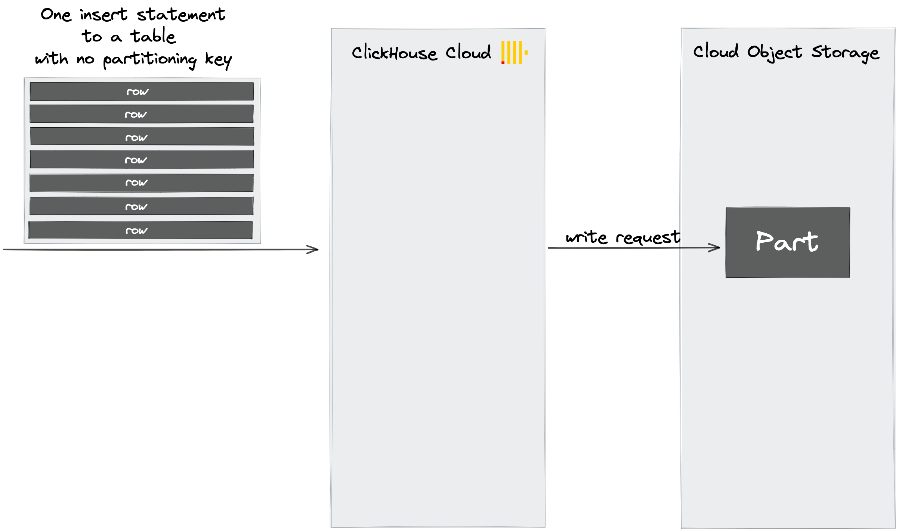
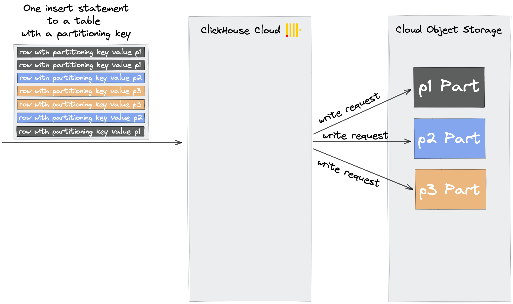

When you send an insert statement (that should contain many rows - see [section above](/optimize/bulk-inserts)) to a table in ClickHouse Cloud, and that
table is not using a [partitioning key](/engines/table-engines/mergetree-family/custom-partitioning-key.md) then all row data from that insert is written into a new part on storage:

However, when you send an insert statement to a table in ClickHouse Cloud, and that table has a partitioning key, then ClickHouse:
- checks the partitioning key values of the rows contained in the insert
- creates one new part on storage per distinct partitioning key value
- places the rows in the corresponding parts by partitioning key value

Therefore, to minimize the number of write requests to the ClickHouse Cloud object storage, use a low cardinality partitioning key or avoid using any partitioning key for your table.
