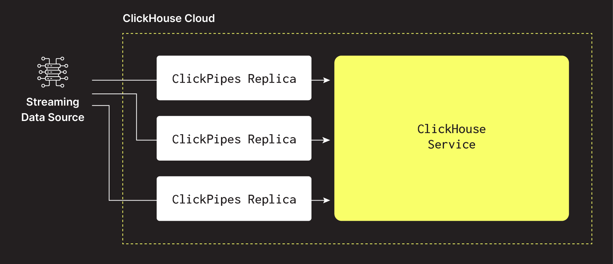
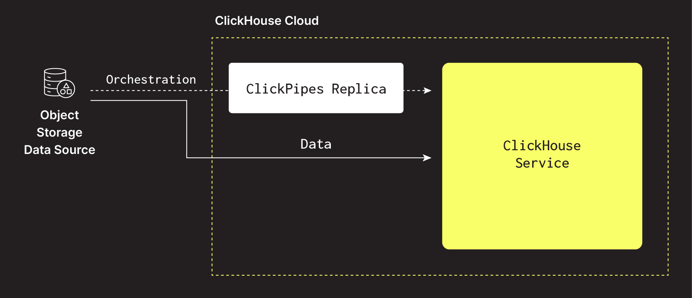
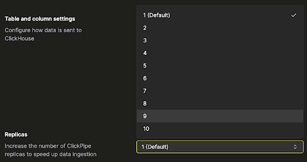

import NetworkPricing from '@site/docs/en/cloud/manage/_snippets/_network_transfer_rates.md';

The following dimensions have been added to the new ClickHouse Cloud pricing.

:::note
Data transfer and ClickPipes pricing will not apply to legacy plans, i.e. Development, Production, and Dedicated, until 24 March 2025.
:::

## Data Transfer Pricing

### How are users charged for data transfer, and will this vary across organization tiers and regions?

- Users will pay for data transfer along two dimensions — public internet egress and inter-region egress. There are no charges for intra-region data transfer or Private Link/Private Service Connect use and data transfer. However, we reserve the right to implement additional data transfer pricing dimensions if we see usage patterns that impact our ability to charge users appropriately.
- Data transfer pricing will vary by Cloud Service Provider (CSP) and region.
- Data transfer pricing will **not** vary between organizational tiers.
- Public egress pricing is based only on the origin region. Inter-region (or cross-region) pricing depends on both the origin and destination regions.

<NetworkPricing/>

### Will data transfer pricing be tiered as usage increases?

Data transfer prices will **not** be tiered as usage increases. Note that the pricing varies by region and cloud service provider.

## ClickPipes Pricing FAQ

### Why are we introducing a pricing model for ClickPipes now?

We decided to initially launch ClickPipes for free with the idea to gather feedback, refine features,
and ensure it meets user needs. 
As the GA platform has grown and effectively stood the test of time by moving trillions of rows, 
introducing a pricing model allows us to continue improving the service, 
maintaining the infrastructure, and providing dedicated support and new connectors.

## What are ClickPipes replicas?

ClickPipes ingests data from remote data sources via a dedicated infrastructure 
that runs and scales independently of the ClickHouse Cloud service. 
For this reason, it uses dedicated compute replicas. 
The diagrams below show a simplified architecture.

For streaming ClickPipes, ClickPipes replicas access the remote data sources (e.g., a Kafka broker), 
pull the data, process and ingest it into the destination ClickHouse service.

In the case of object storage ClickPipes, 
the ClickPipes replica orchestrates the data loading task 
(identifying files to copy, maintaining the state, and moving partitions), 
while the data is pulled directly from the ClickHouse service.

### What is the default number of replicas and their size?

Each ClickPipe defaults to 1 replica that is provided with 2 GiB of RAM and 0.5 vCPU. 
This corresponds to **0.25** ClickHouse compute units (1 unit = 8 GiB RAM, 2 vCPUs).

### Can ClickPipes replicas be scaled?

Currently, only ClickPipes for streaming can be scaled horizontally 
by adding more replicas each with a base unit of **0.25** ClickHouse compute units. 
Vertical scaling is also available on demand for specific use cases (adding more CPU and RAM per replica).

### How many ClickPipes replicas do I need?

It depends on the workload throughput and latency requirements. 
We recommend starting with the default value of 1 replica, measuring your latency, and adding replicas if needed. 
Keep in mind that for Kafka ClickPipes, you also have to scale the Kafka broker partitions accordingly. 
The scaling controls are available under “settings” for each streaming ClickPipe.

### What does the ClickPipes pricing structure look like?

It consists of two dimensions:
- **Compute**: Price per unit per hour  
  Compute represents the cost of running the ClickPipes replica pods whether they actively ingest data or not. 
  It applies to all ClickPipes types.
- **Ingested data**: per GB pricing  
  The ingested data rate applies to all streaming ClickPipes 
  (Kafka, Confluent, Amazon MSK, Amazon Kinesis, Redpanda, WarpStream,
  Azure Event Hubs) for the data transferred via the replica pods. 
  The ingested data size (GB) is charged based on bytes received from the source (uncompressed or compressed).

### What are the ClickPipes public prices?

- Compute: \$0.20 per unit per hour ($0.05 per replica per hour)
- Ingested data: $0.04 per GB

### How does it look in an illustrative example?

For example, ingesting 1 TB of data over 24 hours using the Kafka connector using a single replica (0.25 compute unit) will cost:

$$
(0.25 \times 0.20 \times 24) + (0.04 \times 1000) = \$41.2
$$

For object storage connectors (S3 and GCS), 
only the ClickPipes compute cost is incurred since the ClickPipes pod is not processing data 
but only orchestrating the transfer which is operated by the underlying ClickHouse service:

$$
0.25 \times 0,20 \times 24 = \$1.2
$$

### When does the new pricing model take effect?

The new pricing model will take effect for all organizations created after January 27th, 2025.

### What happens to current users?

Existing users will have a **60-day grace period** where the ClickPipes service continues to be offered for free. 
Billing will automatically start for ClickPipes for existing users on **March 24th, 2025.**

### How does ClickPipes pricing compare to the market?

The philosophy behind ClickPipes pricing is 
to cover the operating costs of the platform while offering an easy and reliable way to move data to ClickHouse Cloud. 
From that angle, our market analysis revealed that we are positioned competitively.

