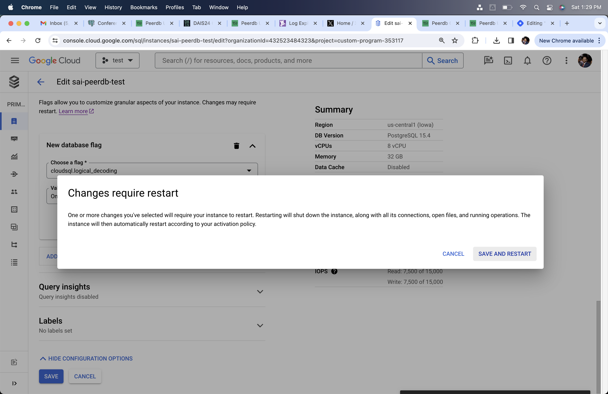
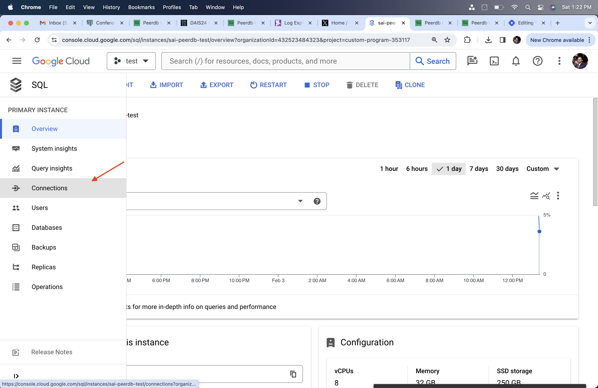
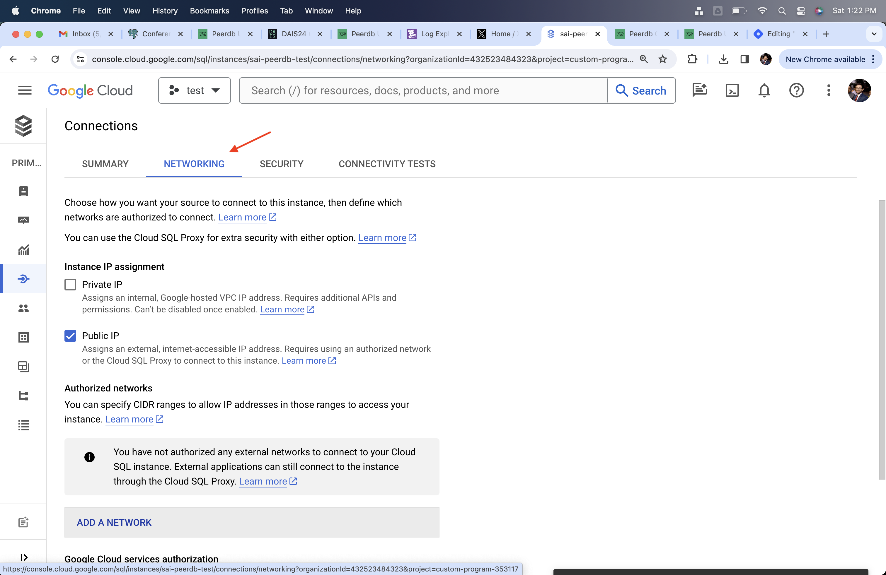
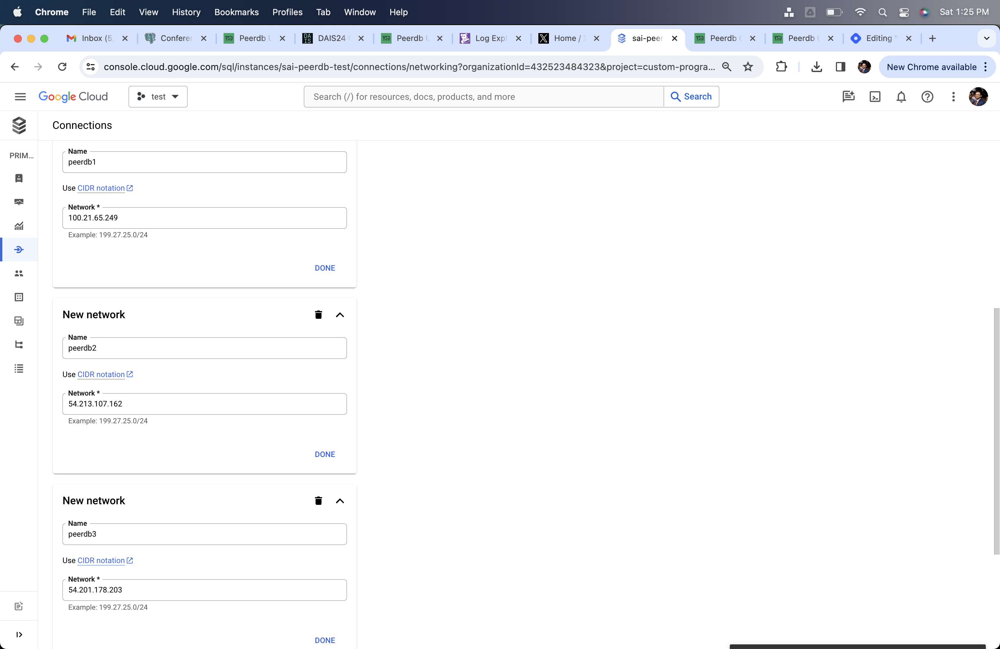
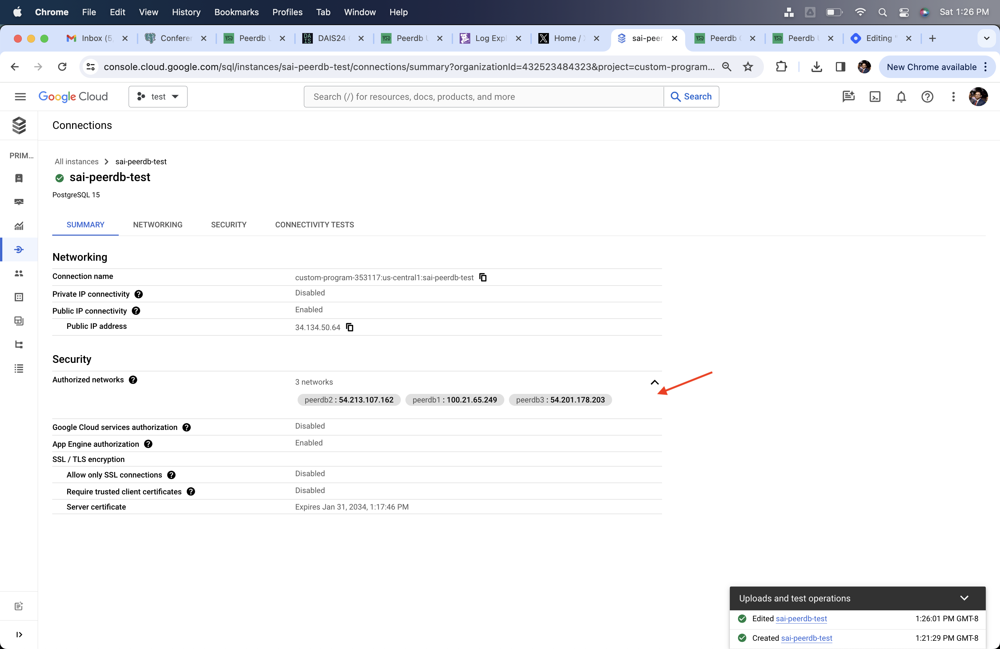

# Google Cloud SQL Postgres Source Setup Guide

:::info

If you use one of the supported providers (in the sidebar), please refer to the specific guide for that provider.

:::


## Supported Postgres versions

Anything on or after Postgres 12

## Enable Logical Replication

**You don't need** to follow the below steps if the settings `cloudsql. logical_decoding` is on and `wal_sender_timeout` is 0. These settings should mostly be pre-configured if you are migrating from another data replication tool.

1. Click on **Edit** button on the Overview page.

   


2. Go to Flags and change `cloudsql.logical_decoding` to on and `wal_sender_timeout` to 0. These changes will need restarting your Postgres server.

   
   
   


## Creating ClickPipes User and Granting permissions

Connect to your Cloud SQL Postgres through the admin user and run the below commands:

1. Create a Postgres user for exclusively ClickPipes.

   ```sql
   CREATE USER clickpipes_user PASSWORD 'some-password';
   ```

2. Provide read-only access to the schema from which you are replicating tables to the `clickpipes_user`. Below example shows setting up permissions for the `public` schema. If you want to grant access to multiple schemas, you can run these three commands for each schema.

   ```sql
   GRANT USAGE ON SCHEMA "public" TO clickpipes_user;
   GRANT SELECT ON ALL TABLES IN SCHEMA "public" TO clickpipes_user;
   ALTER DEFAULT PRIVILEGES IN SCHEMA "public" GRANT SELECT ON TABLES TO clickpipes_user;
   ```

3. Grant replication access to this user:

   ```sql
   ALTER ROLE clickpipes_user REPLICATION;
   ```

4. Create publication that you'll be using for creating the MIRROR (replication) in future.

   ```sql
   CREATE PUBLICATION clickpipes_publication FOR ALL TABLES;
   ```

[//]: # (TODO Add SSH Tunneling)


## Add ClickPipes IPs to Firewall

Please follow the below steps to add ClickPipes IPs to your network.

:::note

If your are using SSH Tunneling, then you need to add the [ClickPipes IPs](../../index.md#list-of-static-ips) to the firewall rules of the Jump Server/Bastion.

:::

1. Go to **Connections** section

   

2. Go to the Networking subsection

   

3. Add the [public IPs of ClickPipes](../../index.md#list-of-static-ips)

   
    


## What's next?

You can now [create your ClickPipe](../index.md) and start ingesting data from your Postgres instance into ClickHouse Cloud.
Make sure to note down the connection details you used while setting up your Postgres instance as you will need them during the ClickPipe creation process.
