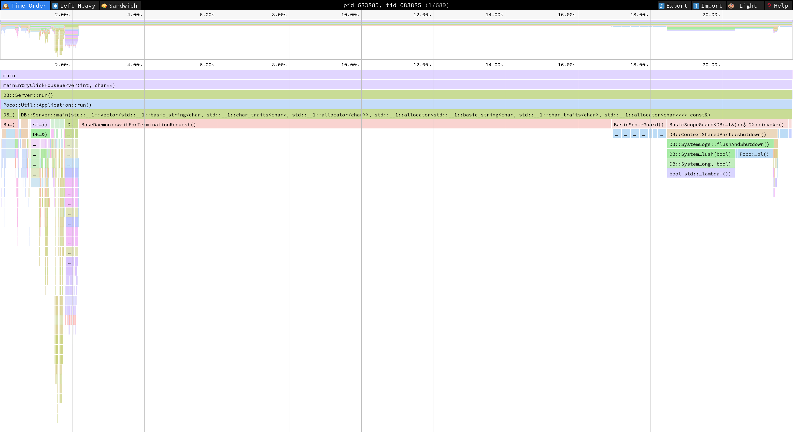

# Profiling ClickHouse with LLVM's XRay

## Types of profilers

LLVM already includes a tool that instruments the code that allows us to do [instrumentation
profiling](https://en.wikipedia.org/wiki/Profiling_(computer_programming)#Instrumentation). As
opposed to [sampling or statistical profiling](https://en.wikipedia.org/wiki/Profiling_(computer_programming)#Statistical_profilers),
it's very precise without losing any calls, at the expense of needing to instrument the code and be
more resource expensive.

<!-- truncate -->

In a few words, an instrumentation profiler introduces new code to track the call to all functions.
Statistical profilers allow us to run the code without requiring any changes, taking snapshots
periodically to see the state of the application. So, only the functions running while the snapshot
is taken are considered. [perf](https://en.wikipedia.org/wiki/Perf_%28Linux%29) is a very well-known
statistical profiler.

## How to profile with XRay

### Instrument the code

Imagine the following souce code:

```cpp
#include <chrono>
#include <cstdio>
#include <thread>

void one()
{
    std::this_thread::sleep_for(std::chrono::milliseconds(10));
}

void two()
{
    std::this_thread::sleep_for(std::chrono::milliseconds(5));
}

int main()
{
    printf("Start\n");

    for (int i = 0; i < 10; ++i)
    {
        one();
        two();
    }

    printf("Finish\n");
}
```

In order to instrument with XRay, we need to add some flags like so:

```bash
clang++ -o test test.cpp -fxray-instrument -fxray-instruction-threshold=1
```

* `-fxray-instrument` is needed to instrument the code.
* `-fxray-instruction-threshold=1` is used so that it instruments all functions, even if they're
  very small as in our example. By default, it instruments functions with [at least 200
  instructions](https://llvm.org/docs/XRay.html#instrumenting-your-c-c-objective-c-application).

We can ensure the code has been instrumented correctly by checking there's a new section in the
binary:

```bash
objdump -h -j xray_instr_map test

test:     file format elf64-x86-64

Sections:
Idx Name          Size      VMA               LMA               File off  Algn
 17 xray_instr_map 000005c0  000000000002f91c  000000000002f91c  0002f91c  2**0
                  CONTENTS, ALLOC, LOAD, READONLY, DATA
```

### Run the process with proper env var values to collect the trace

By default, there is no profiler collection unless explicitly asked for. In other words, unless
we're profiling the overhead is negligible. We can set different values for `XRAY_OPTIONS` to
configure when the profiler starts collecting and how it does so.

```bash
XRAY_OPTIONS="patch_premain=true xray_mode=xray-basic verbosity=1" ./test
==74394==XRay: Log file in 'xray-log.test.14imlN'
Start
Finish
==74394==Cleaned up log for TID: 74394
```

### Convert the trace

XRAy's traces can be converted to several formats. The `trace_event` format is very useful because
it's easy to parse and there are already a number of tools that support it, so we'll use that one:

```bash
llvm-xray convert --symbolize --instr_map=./test --output-format=trace_event xray-log.test.14imlN | gzip > test-trace.txt.gz
```

### Visualize the trace

We can use web-based UIs like [speedscope.app](https://www.speedscope.app/) or
[Perfetto](https://ui.perfetto.dev).

While Perfetto makes visualizing multiple threads and querying the data easier, speedscope is better
generating a flamegraph and a sandwich view of your data.

#### Time Order


#### Left Heavy


#### Sandwitch


## Profiling ClickHouse

1. Pass `-DENABLE_XRAY=1` to `cmake` when building ClickHouse. This [sets the proper compiler
   flags](https://github.com/ClickHouse/ClickHouse/blob/9caac43b2aa5e7c5474a87b7596dea95f5a2569a/cmake/xray_instrumentation.cmake).
2. Set `XRAY_OPTIONS="patch_premain=true xray_mode=xray-basic verbosity=1` env var when running
   ClickHouse to generate the trace.
3. Convert the trace to an interesting format such as trace event: `llvm-xray convert --symbolize
   --instr_map=./build/programs/clickhouse --output-format=trace_event xray-log.clickhouse.ZqKprE |
   gzip > clickhouse-trace.txt.gz`.
4. Visualize the trace in [speedscope.app](https://www.speedscope.app/) or
   [Perfetto](https://ui.perfetto.dev).




Notice that this is the visualization of only one thread. You can select the others `tid`s on the
top bar.

## Check out the docs

Take a look at the [XRay Instrumentation](https://llvm.org/docs/XRay.html) and [Debugging with
XRay](https://llvm.org/docs/XRayExample.html) documentation to learn more details.
